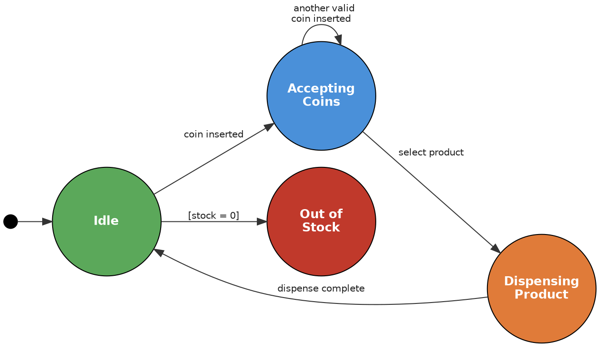
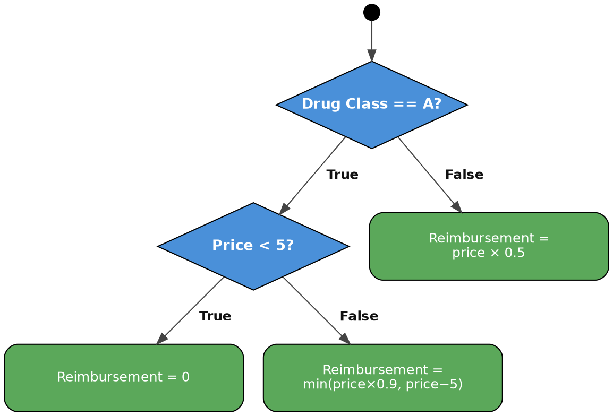

<table width="100%">
<tr>
<td>

<h1 style="margin:-10;">Assignment 1</h1>

</td>
<td align="right">

**Fatima Madey**  
MPCS 56540  
April 10, 2026  

</td>
</tr>
</table>

## Exercise 1 - State-Based Testing
### Vending Machine
Consider a simplified vending machine with the following states:
- Idle
- Accepting Coins
- Dispensing Product
- Out of Stock

### Assumptions
- The machine starts in the Idle state.
- When a coin is inserted, the machine moves from Idle to Accepting Coins.
    - If the machine is out of stock, it moves to Out of Stock.
- If another valid coin is inserted while already in Accepting Coins, it remains in Accepting Coins.
- If the user selects a product while in Accepting Coins, it moves to Dispensing Product.
- After dispensing, the machine returns to Idle.
- Assume there is only one product type and one valid coin type.
- Ignore change return and refund behavior.

### Tasks
- Draw a diagram for the vending machine.
- Create a state transition table.
- Design 6-8 test cases that cover:
    - all valid state transitions;
    - at least two invalid or disallowed transitions;
    - expected system behavior in each relevant state.

### Deliverables
#### Diagram


#### State Transitions Table
| Current State    | Event / Condition          | Next State         | Action / Output             |
|------------------|----------------------------|--------------------|-----------------------------|
| Idle             | coin inserted              | Accepting Coins    | Accept coin                 |
| Idle             | coin inserted + out of stock| Out of Stock       | Display "Out of Stock"      |
| Accepting Coins  | another valid coin inserted| Accepting Coins    | Accept coin                 |
| Accepting Coins  | select product             | Dispensing Product | Dispense product            |
| Dispensing Product | dispense complete        | Idle               | Reset for next customer     |
| Out of Stock     | (any event)                | Out of Stock       | Remain out of stock         |

#### Test Cases
| Test ID| Test Name                     | Current State      | Input / Action          | Expected Next State | Expected Behavior                      |
|--------|-------------------------------|--------------------|-------------------------|---------------------|----------------------------------------|
| 01    | vaildCoinAccepted              | Idle               | Insert coin             | Accepting Coins     | Coin accepted                          |
| 02    | multipleCoinsAccepted          | Accepting Coins    | Insert another coin     | Accepting Coins     | Coin accepted                          |
| 03    | successfulSelection            | Accepting Coins    | Select product          | Dispensing Product  | Product dispensed                      |
| 04    | successfulPurchase             | Dispensing Product | Dispense complete       | Idle                | Ready for next customer                |
| 05    | validOutOfStock                | Idle               | Stock = 0               | Out of Stock        | "Out of Stock" message                 |
| 06    | invalidSelectionBeforePayment   | Idle               | Select product          | Idle                | Error / ignore (no product selected)   |
| 07    | invalidInsertionDuringSelection      | Dispensing         | Insert Coin             | Idle                | Reject Coin or Store for Next Iteration|
| 08    | fullCycle                      | Idle               | Coin → select → dispense| Idle                | Complete transaction                   |

## Exercise 2 - Equivalence Partitioning and Boundary Value Analysis
### Shipping Cost Calculator
You are testing a shipping cost calculator for an e-commerce website. Shipping cost is determined by package weight.

### Rules
- Lightweight package: weight < 5 lb
- Medium-weight package: 5 lb ≤ weight ≤ 20 lb
- Heavy package: weight > 20 lb
- Minimum valid weight: 0 lb
- Maximum valid weight: 50 lb

### Tasks
Using equivalence partitioning and boundary value analysis, design test cases for the weight field.

Your answer must include
1. valid equivalence classes
2. invalid equivalence classes
3. boundary values around:
    - minimum valid weight;
    - the 5 lb cutoff;
    - the 20 lb cutoff;
    - maximum valid weight.
4. A final reduced test set that gives good coverage.

### Deliverables
#### Equivalence Classes
- Valid Equivalence Classes
    - Lightweight: 0 ≤ weight < 5 lb
    - Medium: 5 ≤ weight ≤ 20 lb
    - Heavy: 20 < weight ≤ 50 lb
- Invalid Equivalence Classes
    - Negative weight: (< 0 lb)
    - Over maximum: (> 50 lb)

#### Boundary Values
- Minimum valid: 0, 1 (if including invalid -1)
- 5 lb cutoff: 4, 5, 6
- 20 lb cutoff: 19, 20, 20
- Maximum valid: 49, 50, (if including invalid 51)

#### Test Case Table
| Test ID | Weight (lb) | Expected Class | Expected Result                  |
|---------|-------------|----------------|----------------------------------|
| 1       | -1       | Invalid        | Error: weight must be ≥ 0        |
| 2   | 0           | Lightweight    | Light shipping rate              |
| 3   | 4        | Lightweight    | Light shipping rate              |
| 4   | 5           | Medium         | Medium shipping rate             |
| 5   | 6        | Medium         | Medium shipping rate             |
| 6   | 19      | Medium         | Medium shipping rate             |
| 7   | 20          | Heavy          | Heavy shipping rate              |
| 8   | 21      | Heavy          | Heavy shipping rate              |
| 9   | 50          | Heavy          | Heavy shipping rate              |
| 10   | 51      | Invalid        | Error: weight cannot exceed 50 lb|


## Exercise 3 - Compatibility Testing Strategy
For a web application, design compatibility testing across:
- browsers: Chrome, Firefox, Safari;
- operating systems: Windows, macOS, Linux;
- devices: desktop, mobile, tablet.

### Tasks
1. Create a compatibility matrix showing the configurations to consider.
2. Calculate how many configurations are required for exhaustive testing.
3. Propose a reduced testing strategy that would be realistic in practice.
4. Explain which combinations you would prioritize first and why.

### Deliverables
#### Compatibility Matrix
| Browser | Windows | macOS | Linux | Desktop | Mobile | Tablet |
|---------|---------|-------|-------|---------|--------|--------|
| Chrome  | ✓       | ✓     | ✓     | ✓       | ✓      | ✓      |
| Firefox | ✓       | ✓     | ✓     | ✓       | ✓      | ✓      |
| Safari  | –       | ✓     | –     | ✓       | ✓      | ✓      |

#### Exhaustive Configuration Count
3 browsers × 3 OS × 3 devices = 27 configurations

#### Prioritized Reduced Strategy (9 configs)
- Chrome + macOS + Desktop (highest usage)
- Chrome + Windows + Desktop
- Chrome + Android + Mobile
- Firefox + Windows + Desktop
- Safari + macOS + Desktop
- Safari + iOS + Mobile
- Chrome + iOS + Tablet
- Firefox + Linux + Desktop (edge case)
- Chrome + Windows + Tablet

**Why these first?**
- Chrome dominates ≈65% of the market, making it the top priority for testing.<sup>[1]</sup> Safari is the next most-used browser, though it's exclusive to Apple devices.<sup>[1]</sup> Desktop is the leading platform for e-commerce and should be the primary testing environment, followed by mobile as the fastest-growing second.<sup>[2]</sup> Linux is the lowest priority — it holds the smallest user share and is predominantly used alongside Firefox.<sup>[1]</sup>

**Sources**
1. https://www.browserstack.com/guide/understanding-browser-market-share
2. https://www.mobiloud.com/blog/what-percentage-of-internet-traffic-is-mobile


## Exercise 4 - White-Box Coverage
### Healthy Inc. Reimbursement Logic
Healthy Inc. is a medical insurance company that reimburses drug costs.

### Rules
Two drug classes are used for reimbursement:
- Class A: 90% of the cost is reimbursed, with a minimum customer participation of $5.
    - Example: a $10 drug is reimbursed by $5.
    - Example: an $80 drug is reimbursed by $72.
- Class B: 50% of the cost is reimbursed.
- For some Class A drugs priced below $5, there is no reimbursement.

Use the following pseudocode for this exercise:

```
if drugClass == A:
    if price < 5:
        reimbursement = 0
    else:
        reimbursement = min(price * 0.9, price - 5)
elif drugClass == B:
    reimbursement = price * 0.5
```

### Tasks
1. Convert the logic above into a program flow graph.
2. Provide test cases needed to achieve:
    - 100% statement coverage
    - 100% branch coverage
    - 100% path coverage
3. For each test case, map it to the parts of the graph it covers.

### Deliverables
#### Program Flow Graph


#### Coverage-Oriented Test Case Table
- Statement Coverage

| Test ID | Drug Class | Price | Nodes Covered         | Reimbursement |
|---------|------------|-------|-----------------------|---------------|
| 1       | A          | 3     | N1, N2, N3        | 0             |
| 2       | B          | 100   | N1, N5            | 50            |
| 3       | A          | 80    | N1, N2, N4      | 72            |

- Branch Coverage

| Test ID | Drug Class | Price | Branch Taken              | Reimbursement |
|---------|------------|-------|---------------------------|---------------|
| 1       | A          | 3     | N1=Yes, N2=Yes            | 0             |
| 2       | A          | 80    | N1=Yes, N2=No             | 72            |
| 3       | B          | 100   | N1=No                     | 50            |

- Path Coverage

| Test ID | Drug Class | Price | Path Taken              | Reimbursement |
|---------|------------|-------|--------------------------|---------------|
| 1       | A          | 3     | N1 → N2 → N3      | 0             |
| 2       | A          | 80    | N1 → N2 → N4      | 72            |
| 3       | B          | 100   | N1 → N5          | 50            |


## Exercise 5 - Gray-Box API Testing
Gray-box testing is a testing approach that combines elements of black-box and white-box testing. In gray-box testing, the tester does not have access to the full source code, but does have some partial knowledge of the system, such as an API specification, architecture information, database schema, or workflow rules. This allows the tester to design stronger tests than pure black-box testing while still testing from an external perspective.

In this exercise, you are given access to an Order Submission API specification, but not the source code.

### API Endpoint
`POST /api/v1/orders`

### Headers
`Authorization: Bearer <token>` (required)

`Content-Type: application/json`

### Request Body
```
{
  "customer_id": "string",
  "items": [
    {
      "product_id": "string",
      "quantity": "integer"
    }
  ],
  "delivery_date": "YYYY-MM-DD",
  "priority": "normal" | "rush"
}
```

### Response Expectations
- `200 OK`: success
- `400 Bad Request`: missing or invalid fields
- `401 Unauthorized`: bad or missing token
- `422 Unprocessable Entity`: logical business issue, such as out-of-stock
- `500 Internal Server Error`

### Tasks
Write 6 test cases covering:
- 2 valid requests;
- 2 invalid structure/data cases that should return `400`;
- 1 business rule failure that should return `422`;
- 1 security failure that should return `401`.

For each test case, specify:
- test name / ID;
- headers;
- input JSON;
- expected status code;
- expected response pattern;
- reason for expected result.

#### Assumption
For the `422` case, you may assume a documented business rule such as out-of-stock or another clear logical fulfillment failure.

### Deliverables
#### Table of 6 Test Cases
| Test ID | Test Name                        | Headers                              | Input JSON (body)                                                                                                                           | Expected Status | Expected Response Pattern                        | Reason (gray-box knowledge)       |
|---------|----------------------------------|--------------------------------------|---------------------------------------------------------------------------------------------------------------------------------------------|-----------------|--------------------------------------------------|-----------------------------------|
| 1  | Valid normal order               | Authorization: Bearer `<valid-token>`  | `{"customer_id":"C123","items":[{"product_id":"P1","quantity":2}],"delivery_date":"2026-04-20","priority":"normal"}`                        | 200             | `{"order_id": "...", "status": "created"}`       | All fields valid                  |
| 2  | Valid rush order                 | Authorization: Bearer `<valid-token>`  | same as 1 but let `"priority":"rush"`                                                                                                       | 200             | `{"order_id": "...", "status": "created"}`       | Business rule allows rush         |
| 3  | Invalid – missing customer_id   | Authorization: Bearer `<valid-token>`  | `{"items":[...],"delivery_date":"2026-04-20","priority":"normal"}`                                                                          | 400             | `{"error": "missing field: customer_id"}`        | Required field (API spec)         |
| 4  | Invalid – type for product_id is integer    | Authorization: Bearer `<valid-token>`  | `{"customer_id":"C123","items":[{"product_id": 1,"quantity":1}],"delivery_date":"2026-04-20","priority":"normal"}`                       | 400             | `{"error": "quantity must be positive"}`         | Data validation                   |
| 5  | Business rule – out of stock     | Authorization: Bearer `<valid-token>`  | same as 1 but product is documented out-of-stock                                                                                       | 422             | `{"error": "out of stock"}`                      | Documented business rule          |
| 6  | Security – missing token         | (no Authorization header)            | same as 1                                                                                                                              | 401             | `{"error": "unauthorized"}`                      | API spec requires token           |

## Exercise 6 - Static Analysis / Linter Demo
Install and configure a linter or static analysis tool for one of the following languages:
- Python
- Java
- JavaScript
- C++
Examples include ESLint, Pylint, Flake8, PMD, Checkstyle, or Cppcheck.

### Tasks
1. Install and configure one linter/static analysis tool.
2. Configure it to detect:
    - at least 5 style-related issues
    - at least 5 logic / code-quality issues
3. Prepare one or more source files that intentionally contain issues.
4. Run the tool and capture the output.

### Requirements
- You must demonstrate at least 10 findings total.
- At least 8 findings must come from distinct rule types.
- Repeating the same issue many times does not satisfy the distinctness requirement.

### Deliverables
the source code file(s) showing the issues;
the linter configuration file;
screenshots of the terminal or tool output showing the detected issues.


## Use of External Resources
- Used Claude AI to generate graphs based on node description and flow.
- Also used Claude to do some formatting for my markdown file.
- Used copiolet autocomplete to generate my python code for exercies 6.
- Asked Claude to grade my assignment to catch any small errors I might have made.
- Claude convo ()
