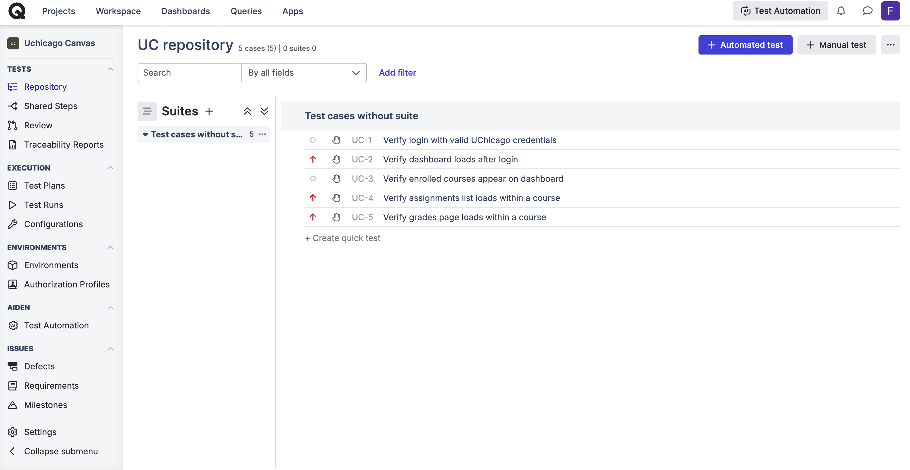
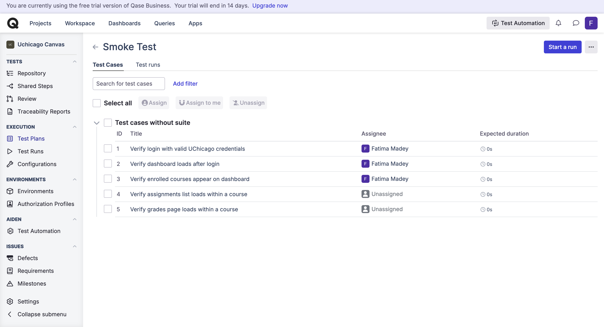
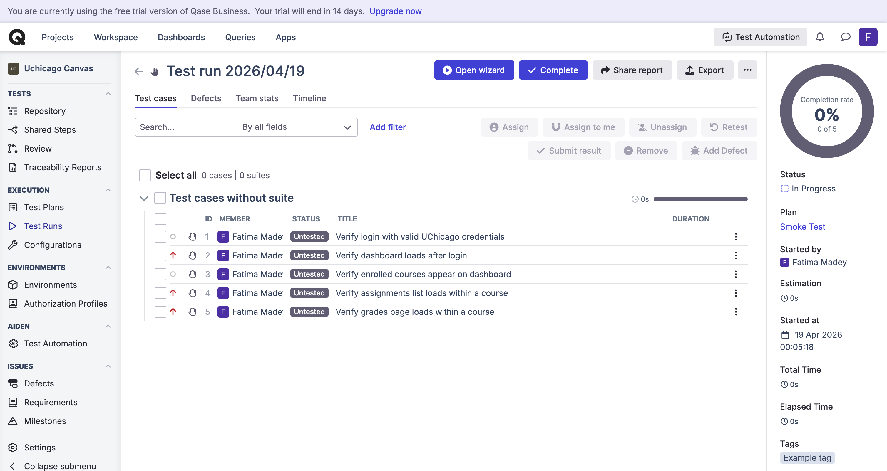

<table width="100%">
<tr>
<td>

<h1 style="margin:-10;">Assignment 2</h1>

</td>
<td align="right">

**Fatima Madey**  
MPCS 56540  
April 17, 2026  

</td>
</tr>
</table>

## Exercise 1: User Stories, Acceptance Criteria, and Test Cases

Choose one feature from any social media platform such as Instagram, TikTok, Facebook, X, Snapchat, or LinkedIn.

### Tasks
1. Write **5 user stories** related to that single feature using standard user story format:
   > As a [type of user], I want [goal], so that [benefit].

2. For each user story, write at least **3 acceptance criteria** in Gherkin format using:
   > Given / When / Then

3. For acceptance criteria, write **3 test cases**:
   - 2 positive test cases
   - 1 negative test case

### Deliverables
#### Feature: Instagram Story Posting
#### User Story 1
*As a creator, I want to post a photo taken on my phone on my Instagram Story, so that I can share what I am up to with my friends*

**Gherkin Acceptance Criteria**
1. Given the user is logged in, when they select the button to add a new story, then the system should display recent photos they can choose from.
2. Given the user selects a picture, when they attempt to add a text overlay, then the system should display text editing tools (font, color, size).
3. Given the user has finished editing their story, when they tap "Share to Story," then the story should be published and visible to their followers for 24 hours.

**Test Cases for Acceptance Criteria**

| # | Title | Type | Preconditions | Steps | Expected Result |
|---|-------|------|---------------|-------|-----------------|
| 1 | Successful story post from camera roll | Positive | User is logged in, has photos in camera roll | 1. Tap + to add story 2. Select a photo 3. Tap "Share to Story" | Story is published and visible to followers |
| 2 | Text overlay added to story photo | Positive | User is logged in, has selected a photo | 1. Select a photo 2. Tap the text tool 3. Type text and tap Done | Text appears on the photo with editing options available |
| 3 | Story post fails when no media is selected | Negative | User is logged in and has not selected any media | 1. Tap + to add story 2. Tap the post button without selecting any media | A "please add media" prompt is displayed and the story is not posted |

#### User Story 2
*As an instagram user, I want to be able to view the stories the people I follow post, so that I can stay updated on their day to day life.*

**Gherkin Acceptance Criteria**
1. Given the user is logged in, when they open the app, then the stories of accounts they follow should appear at the top of the feed.
2. Given a story is available, when the user taps on it, then the story should play automatically in full screen.
3. Given the user is viewing a story, when they tap the right side of the screen, then the next story in the sequence should play.

**Test Cases for Acceptance Criteria**

| # | Title | Type | Preconditions | Steps | Expected Result |
|---|-------|------|---------------|-------|-----------------|
| 1 | Stories appear on home feed | Positive | User is logged in and follows accounts with active stories | 1. Open the app 2. View top of home feed | Story bubbles of followed accounts are visible |
| 2 | Tapping a story plays it in full screen | Positive | User is logged in, stories are available | 1. Tap on a story bubble | Story opens and plays in full screen |
| 3 | Story from a private account is not visible to a non-follower | Negative | User is logged in and does not follow a private account | 1. Navigate to a private account's profile | No story bubble is visible or accessible |

#### User Story 3
*As a creator, I want to see how many people viewed my story, so that I can gauge engagement and interest of my followers.*

**Gherkin Acceptance Criteria**
1. Given the user has an active story, when they swipe up on their own story, then the system should display a list of viewers and a view count.
2. Given the user views their story insights, when the story has been viewed by followers, then each viewer's username should be listed.
3. Given the story has expired after 24 hours, when the creator checks story insights, then the view count and viewer list should still be accessible in the archive.

**Test Cases for Acceptance Criteria**

| # | Title | Type | Preconditions | Steps | Expected Result |
|---|-------|------|---------------|-------|-----------------|
| 1 | View count displayed on active story | Positive | User is logged in and has an active story with at least one view | 1. Open own story 2. Swipe up | View count and list of viewers is displayed |
| 2 | Viewer list updates after new view | Positive | User has an active story | 1. Another account views the story 2. Creator swipes up on story | New viewer appears in the viewer list |
| 3 | View count not visible on another user's story | Negative | User is logged in and viewing someone else's story | 1. Tap on a followed account's story 2. Swipe up | No viewer list or count is shown to the non-owner |

#### User Story 4
*As an Instagram user, I want to like stories people post, so that I can show appreciation and support.*

**Gherkin Acceptance Criteria**
1. Given the user is viewing a story, when they double-tap the screen, then a heart reaction should be sent to the story's creator.
2. Given the user sends a reaction, when the creator opens their story viewer list, then the reaction should appear next to the sender's username.
3. Given the user has already reacted to a story, when they try to react again, then only one reaction per user should be recorded.

**Test Cases for Acceptance Criteria**

| # | Title | Type | Preconditions | Steps | Expected Result |
|---|-------|------|---------------|-------|-----------------|
| 1 | Double-tap sends heart reaction | Positive | User is logged in and viewing a story | 1. Open a story 2. Double-tap the screen | A heart reaction is sent and a brief animation plays |
| 2 | Reaction appears in creator's viewer list | Positive | User has sent a reaction to a story | 1. Creator opens their story 2. Swipes up to view reactions | The reactor's username appears with the heart emoji |
| 3 | Creator cannot react to their own story | Negative | User is logged in and viewing their own active story | 1. Open own story 2. Attempt to double-tap to react | No reaction option is available; double-tap does not send a reaction |

#### User Story 5
*As a creator, I want to be able to delete a story, so that I can change my mind when I no longer like a story I posted.*

**Gherkin Acceptance Criteria**
1. Given the user is viewing their own active story, when they tap the three-dot menu, then a "Delete" option should be displayed.
2. Given the user taps "Delete," when they confirm the deletion, then the story should be immediately removed and no longer visible to followers.
3. Given a story has already expired after 24 hours, when the user attempts to delete it from their archive, then the story should be removable from the archive view.

**Test Cases for Acceptance Criteria**

| # | Title | Type | Preconditions | Steps | Expected Result |
|---|-------|------|---------------|-------|-----------------|
| 1 | Creator can delete an active story | Positive | User is logged in and has an active story | 1. Open own story 2. Tap three-dot menu 3. Tap "Delete" 4. Confirm | Story is deleted and no longer visible to followers |
| 2 | Deleted story disappears from followers' feed | Positive | User has an active story that followers can see | 1. Creator deletes the story 2. Follower refreshes their feed | Story bubble for that creator is no longer shown |
| 3 | User cannot delete another creator's story | Negative | User is logged in and viewing someone else's story | 1. Open another user's story 2. Tap three-dot menu | No "Delete" option is shown; only options like "Report" are available |

---

## Exercise 2: Smoke Test Plan for UChicago Canvas

Assume a new build of the UChicago Canvas website has been deployed and you are responsible for preparing a smoke test plan.

### Tasks

1. Create a smoke test plan using the test plan template provided in class.
2. Identify the modules that should be included in the smoke test plan.
3. For each module, provide a list of smoke test case titles only. Detailed test steps are not required.

### Deliverables

**Test Plan Name:** UChicago Canvas Smoke Test Plan

**Testing Objectives**
- Verify Functionality: Ensure core Canvas modules (login, dashboard, courses, assignments, grades) load and are accessible after the new build.
- Usability Testing: Confirm that critical user workflows are functional and navigation is intact.
- Compatibility Testing: Ensure Canvas works across different browsers.

**Scope and Coverage**
- In Scope:
  - Functional testing of core modules: Authentication, Dashboard, Courses, Announcements, Assignments, Grades, Files, Navigation
  - Cross-browser compatibility (Chrome, Firefox, Safari)
- Out of Scope:
  - Detailed functional testing of individual features
  - Performance and load testing
  - Mobile app testing
  - Accessibility testing

**Testing Approach**
- Manual Testing: For verifying critical paths and core module accessibility after each build deployment.
- Automated Testing: Using tools like Selenium for repetitive functional tests and JMeter
for performance testing.

**Test Deliverables**
- Smoke test case results
- Pass/fail status summary report

**Test Environment and Resources**
- Test Environment:
  - UChicago Canvas staging environment
  - Browsers: Chrome, Firefox, Safari, and Edge
- Resources:
  - Test Lead and Test Engineers.
  - Valid UChicago student and instructor test accounts 

**Risks and Contingency Plans**
- If smoke tests fail, escalate to developers immediately and roll back the build before any further testing proceeds.

---

**Modules and Smoke Test Case Titles**

**Authentication**
- Verify login with valid UChicago credentials
- Verify logout redirects to login page

**Dashboard**
- Verify dashboard loads after login
- Verify enrolled courses appear on dashboard

**Courses**
- Verify course list is accessible
- Verify clicking a course opens the course homepage

**Announcements**
- Verify announcements page loads within a course

**Assignments**
- Verify assignments list loads within a course
- Verify clicking an assignment displays its details

**Grades**
- Verify grades page loads within a course

**Files**
- Verify files page loads within a course

**Navigation**
- Verify global navigation links (Dashboard, Courses, Calendar, Inbox) are accessible

---

## Exercise 3: Regression Test Plan for New Release

A new release will introduce a new **Quizzes** module and enhancements to the **Assignments** module.

### Tasks

1. Create a regression test plan using the test plan template provided in class.
2. Identify the modules that should be included in the regression test plan.
3. For each module, provide a list of regression test case titles only. Detailed test steps are not required.

### Deliverables

- A regression test plan based on the class template
- A list of included modules
- A list of regression test case titles for each module

**Test Plan Name:** UChicago Canvas Regression Test Plan — New Release

**Testing Objectives**
- Verify New Functionality: Ensure the new Quizzes module works correctly end-to-end for both students and instructors.
- Verify Enhancements: Confirm that changes to the Assignments module function as expected without introducing new defects.
- Regression Verification: Ensure that existing modules (Grades, Dashboard, Courses, Navigation) have not been broken by the new release.

**Scope and Coverage**
- In Scope:
  - Full functional testing of the new Quizzes module
  - Functional testing of the enhanced Assignments module
  - Regression testing of impacted modules: Grades, Dashboard, Courses, Navigation
- Out of Scope:
  - Modules with no changes and no dependencies on Quizzes or Assignments (e.g., Files, Announcements)
  - Performance and load testing
  - Mobile app testing

**Testing Approach**
- Manual Testing: For new Quizzes functionality and enhanced Assignments workflows.
- Regression Testing: Re-executing existing test cases for Grades, Dashboard, and Navigation to confirm no regressions.

**Test Deliverables**
- Regression test case results
- Defect log for any regressions or new defects found
- Final test summary report

**Test Environment and Resources**
- Test Environment:
  - UChicago Canvas staging environment with the new release deployed
  - Browsers: Chrome, Firefox, Safari, and Edge
- Resources:
  - QA Tester
  - Valid UChicago student and instructor test accounts

**Risks and Contingency Plans**
- Changes to the Assignments module may impact grade calculations; prioritize Grades regression testing.
- If critical regressions are found, escalate to developers before the release proceeds.

---

**Modules and Regression Test Case Titles**

**Quizzes (New)**
- Verify instructor can create a new quiz
- Verify instructor can add multiple choice questions to a quiz
- Verify instructor can set a quiz due date and time limit
- Verify student can view and access an available quiz
- Verify student can submit a completed quiz
- Verify submitted quiz is recorded in the gradebook

**Assignments (Enhanced)**
- Verify instructor can create a new assignment
- Verify existing assignments still display correctly after enhancement
- Verify student can submit an assignment
- Verify assignment submission confirmation is shown after submit
- Verify assignment due dates still appear correctly on the calendar

**Grades**
- Verify grades page reflects quiz scores after submission
- Verify grades page reflects assignment scores after grading
- Verify overall course grade calculates correctly with new quiz scores

**Dashboard**
- Verify upcoming quizzes appear in the to-do list on the dashboard
- Verify upcoming assignments still appear correctly on the dashboard

**Navigation**
- Verify Quizzes link appears in course navigation
- Verify all existing navigation links remain functional

---

## Exercise 4: Test Case Management Tool Exploration

Explore one online test case management tool, such as:

- Zephyr Scale for Jira
- TestRail
- Qase
- Xray
- Any comparable tool

### Tasks

1. Use the test plan and test cases you developed in Exercise 2.
2. Enter them into the selected test case management tool.
3. Create:
   - At least **5 test cases** from Exercise 2
   - At least **1 test plan or test cycle** based on Exercise 2
4. Execute the test cases and record their status.
5. Submit screenshots.

### Deliverables

**Tool Used:** Qase

**Screenshots**

Test Cases entered in Qase:

Test Plan / Test Cycle in Qase:

Execution Results:

**Reflection**
I used Qase, a cloud-based test case management tool. One thing I really liked about Qase was how intuitive it was to organize test cases by module and assign them to a test run. It made it easy to see the full scope of what needed to be tested. It also let's you assign tests to specific people so which I thought was nice since knowing who is responsible for which test case reduces confusion and ensures accountability. What was difficult was the execution phase. None of my test cases executed successfully, after investigating I realized it was because I selected manual testing so it expected me to perform the steps myself and Qase just records the results so it just marked it as failed.
